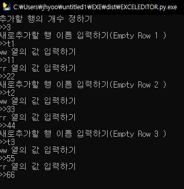
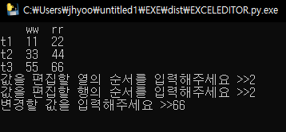

Simple Excel Editor
===
***
- Simple Excel Editor using pandas library.

- Using Language : Python 3.7

- Dev Env : Jetbrain Pycharm

- Used library & modules : pandas, os,time,sys,warnings,numpy,pyinstaller

- exe link : [here](https://drive.google.com/open?
id=14cZh265q9hwrnnkNOqq_atpaaAErUyqH)

- exe file is in directory 'dist'
***

### How to use?

- First when you open program Cli will open database select menu. Two example database were given for test. If you want to use program from first, delete dbSaver folder.

    

- When you select Create New DB menu, You can create new DataBase.

    - First you need to enter database's name.

    - Second you need to enter number of columns you want to genereate.

    - According to the number you enter(number of columns), you need to write each columns's name.

        

- After you create database, menu will be like this.

    

- Let's say i want to add some rows. then select 4 . Add Data. Then menu will appear like this.

    

    - When you want to add rows, select option number 2.

    - First you need to write number of row you want to add, and enter data of each columns

        
    
    - Then you can see rows are added

        

- if you want to edit specified value, select option 9. Menu of option 9 looks like this

    

    - if you want to edit select 1

    - In this option you need to enter row and col number each about the data you want to edit

        

    - After you go to menu, you can see data has changed.

        
    
- If you want to save data select 8

- If you want to change database you want to edit, select option 3

    - If you haven't saved database after edit datas, option that ask you to save will open.

        
    
    - After you select another database to edit and go to menu, you can see selected database has been changed.

        

- If there's bug in this program, please contact to jhyoon0815103@gmail.com

